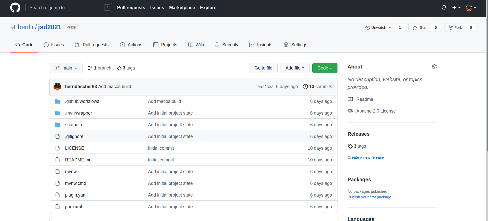

[%notitle]
=== NoTile

[source,shell]
.general usage
----
$ kubectl generate <resource.type> <resource.name> <arguments>

# example
$ kubectl generate sc test --provisioner nfs
----

.translation to "picocli-terms"
----
- plugin-name: generate
- parameters : resource-type (sc), resource-name (test)
- options    : arguments (starting with "-" or "--")
----

[%notitle]
=== NoTitle

[source,java]
.GenerateCommand
----
@TopCommand()
@CommandLine.Command(name="generate",version="1.0.0-SNAPSHOT")
public class GenerateCommand implements Runnable {

  @CommandLine.Parameters() String resourceType;
  @CommandLine.Parameters() String resourceName;

  @CommandLine.Option(names={"--provisioner"},required=true)
  String provisioner;
  
  @Override
  public void run() {
      System.out.println("Hello");
  }
}
----

[%notitle]
=== NoTitle

[source,xml]
.Templating - Add Dependency
----
    <dependency>
      <groupId>io.quarkus</groupId>
      <artifactId>quarkus-qute</artifactId>
    </dependency>
----

[%notitle]
=== NoTitle

[source,highlight=4|8..10]
.Templating - Add Template
----
apiVersion: storage.k8s.io/v1
kind: StorageClass
metadata:
  name: {params.name}
allowVolumeExpansion: false
allowedTopologies:
mountOptions:
{#for option in params.mountOptions.orEmpty}
- {option}
{/for}
parameters:
provisioner: {params.provisioner}
reclaimPolicy: Delete
volumeBindingMode: Immediate
----

[.notes]
--
* store template as file "storageclass.txt" in folder "resources/templates"
--

[%notitle]
=== NoTitle

[source,java,highlight=3..4|7..11]
.Templating - Add TemplateClass
----
@CheckedTemplate
public class Templates {
  public static native 
  TemplateInstance storageclass(ScParams params);
}

class ScParams {
  public String name;
  public String provisioner;
  List<String> mountOptions;
}
----

[.notes]
--
* store it as file "Templates.java" in folder "main/java/de/benfir/k8s/plugins"
--

[%notitle]
=== NoTitle

[source,java,highlight=8..9]
.Templating - Add TemplateClass
----
  @Override public void run()
  {
    ScParams p = new ScParams();
    p.name = this.resourceName;
    p.provisioner = this.provisioner;
    p.mountOptions = Arrays.asList("opt1","opt2");
    
    TemplateInstance ti = Templates.storageclass(p);
    String str = ti.render();
  }
----

[.notes]
--
* belongs to class "GenerateCommand"
--

[%notitle]
=== NoTitle

[source,java]
.Apply to Kubernetes
----
  // we added fabric8 as Kubernetes client framework already
  @Override public void run()
  {
    // ...
    try(KubernetesClient kc = new DefaultKubernetesClient()){
      kc.resourceList(ti.render()).createOrReplace();
    }
  }
----

=== Final Structure

[plantuml,intersections,png]
----
@startuml
skinparam dpi 150 
class GenerateCommand <<TopCommand>> <<Command>> {
  - dryRun: boolean
  + execute(): int
}
class GenerateStorageClassCommand <<Command>> {
  - scParams
}
class GeneratePvcCommand <<Command>> {
  - pvcParams
}
GenerateCommand <|-- GenerateStorageClassCommand
GenerateCommand <|-- GeneratePvcCommand
@enduml
----

//[%notitle,background-iframe="https://github.com/benfir/jsd2021"]
[%notitle]
=== NoTitle

https://github.com/benfir/jsd2021
