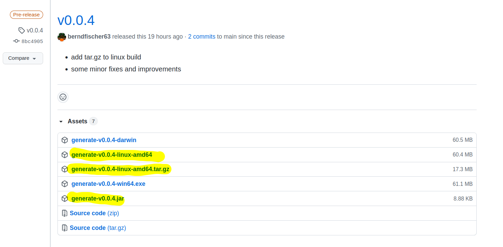

=== Krew - Packaging

[source,shell]
----
$ tar -czf \
  ./target/generate_v0.0.4-linux_amd64.tar.gz \
  ./target/generate-v0.0.4-runner
----

=== Krew - Manifest

[source,yaml,highlight=1..2|4|6|11..15|16..17|18..21]
----
apiVersion: krew.googlecontainertools.github.com/v1alpha2
kind: Plugin
metadata:
  name: generate
spec:
  version: "v0.0.4"
  shortDescription: A new plugin
  homepage: https://github.com/benfir/jsd2021
  description: |
    This pluging generates k8s manifests for ...
  platforms:
  - selector:
      matchLabels:
        os: linux
        arch: amd64
    uri: https://github.com/benfir/jsd2021/releases/...
    sha256: 9aec5d0ddaa7330662af1938d03f6cfbee0d6a6...
    files:
    - from: "./*"
      to: "."
    bin: "target/generate-v0.0.4-runner"
----

=== Github Actions

[source,highlight=1|8..9|10..11|12..13|14..15|16..17|18..19]
----
name: release-build-linux
jobs:
  build:
    steps:
    <...>
    - name: Set version
      run: ./mvnw versions:set <...>
    - name: Build jvm jar
      run: ./mvnw package
    - name: Upload package
      <...>
    - name: Build native executable
      run: ./mvnw package -Dnative
    - name: Upload native executable
      <...>
    - name: Build tar.gz
      run: tar -czf <...>
    - name: Upload tar.gz
      <...>
----

=== !

=== !

[source,shell,highlight=1|3|4..12|13..15]
----
$ kubectl krew list | grep -i generate

$ kubectl krew install --manifest-url=https://raw...
Updated the local copy of plugin index.
Installing plugin: generate
Installed plugin: generate
\
 | Use this plugin:
 |      kubectl generate
 | Documentation:
 |      https://github.com/benfir/jsd2021
/

$ kubect krew list | grep -i generate
detached/generate
----

[.notes]
--
kubectl krew install --manifest-url=https://raw.githubusercontent.com/benfir/jsd2021/main/plugin.yaml
--

=== !

[source,shel,highlight=1|2..12]
----
$ kubectl generate sc testclass --provisioner=gold
apiVersion: storage.k8s.io/v1
kind: StorageClass
metadata:
  name: testclass
allowVolumeExpansion: false
allowedTopologies:
mountOptions:
parameters:
provisioner: gold
reclaimPolicy: Delete
volumeBindingMode: Immediate
----

=== Multiple Platforms - GraalVM

[%step]
* cross compiling is complex and slow
* build-hardware for every target
* solution for OSS
** build platforms like Github Actions

=== Multiple Platforms - Krew

* necessary to extend krew manifest
