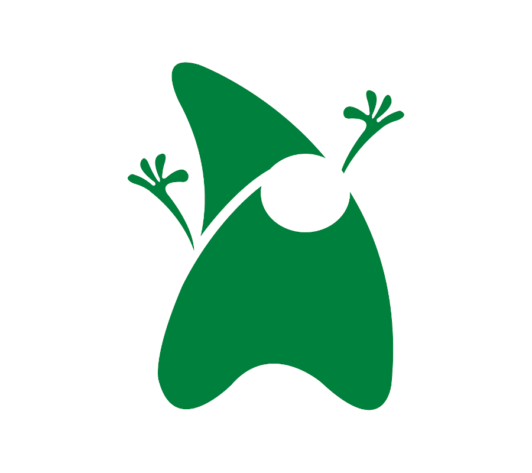
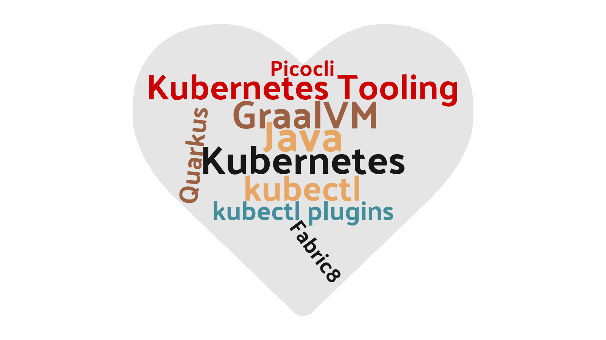
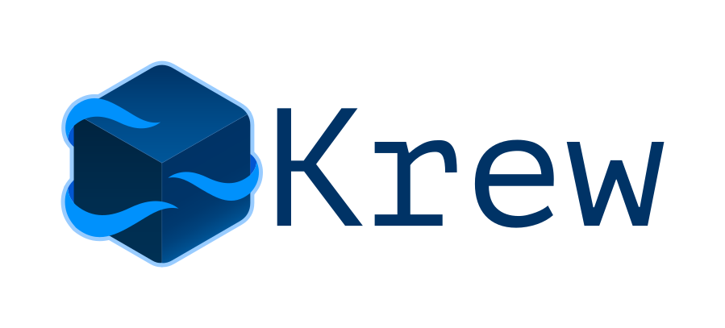

= JUG Saxony Day 2021
:revealjs_theme: beige
:revealjs_slideNumber: true
:revealjs_showSlideNumber: all
:revealjs_center: true
:revealjs_progress: true
:name: Bernd Fischer
:icons: font
:source-highlighter: highlightjs

== Extend Kubernetes-CLI with Java

**Bernd Fischer**

== Topics

// === Challenges

// [%step]
// * Presentation Tooling
// [%step]
// ** Asciidoc-Revealjs
// ** Clickmeeting
// * Live Coding ;-)

=== !

[.notes]
--
improve Kubernetes tooling
--

=== !

.kubectl - create Kubernetes resources/objects
----
run
  <...>               Create a Pod
create
  clusterrole         Create a ClusterRole.
  clusterrolebinding  Create a ClusterRoleBinding ...
  configmap           Create a configmap ...
  cronjob             Create a cronjob ...
  deployment          Create a deployment ...
  ingress             Create a ingress ...
  job                 Create a job ...
  namespace           Create a namespace ...
  poddisruptionbudget Create a pod disruption budget ...
  priorityclass       Create a priorityclass ...
  quota               Create a quota ...
  role                Create a role ...
  rolebinding         Create a RoleBinding ...
  secret              Create a secret ...
  service             Create a service ...
  serviceaccount      Create a service ...
----

[%notitle]
=== NoTitle

Whats about all other Kubernetes resources/objects?

[%step]
* StorageClass
* PersistentVolumeClaim
* PersistentVolume
* IngressClass
* DaemonSet
* StatefulSet
* ...

=== Goals

[source,shell]
----
$ kubectl generate sc goldstorage <...>
----

[%step]
* support for multiple platform (Linux, Win, MacOS)
* distribution and operation (install, update, remove) as simple as possible

== Kubectl - How it works?

include::01_kubectl.adoc[]

== Kubectl - Plugins

include::02_kubectl-plugins.adoc[]

== Implementation Considerations

include::03_considerations.adoc[]

== Quarkus Project

include::04_quarkus-project.adoc[]

== Plugin Project

include::05_plugin-project.adoc[]

== !

include::06_krew.adoc[]

== Krew - How to Distribute Plugins

include::07_distribute.adoc[]

== One More Point

[%notitle]
=== One more point

image::images/jbang.png[]

== !

image::images/detective-1424831_1280.png[background,size=contain]

== !

== Links

* https://quarkus.io/
* https://picocli.info
* https://github.com/fabric8io/kubernetes-client
* https://quarkus.io/guides/qute
* https://docs.github.com/en/actions
* https://www.graalvm.org/

== Links

Thankfully using ...

* Image by https://pixabay.com/users/graphicmama-team-2641041/?utm_source=link-attribution&amp;utm_medium=referral&amp;utm_campaign=image&amp;utm_content=1424831[GraphicMama-team] from https://pixabay.com/?utm_source=link-attribution&amp;utm_medium=referral&amp;utm_campaign=image&amp;utm_content=1424831[Pixabay]

* Image by https://pixabay.com/users/geralt-9301/?utm_source=link-attribution&amp;utm_medium=referral&amp;utm_campaign=image&amp;utm_content=3040081[Gerd Altmann] from https://pixabay.com/?utm_source=link-attribution&amp;utm_medium=referral&amp;utm_campaign=image&amp;utm_content=3040081[Pixabay]

